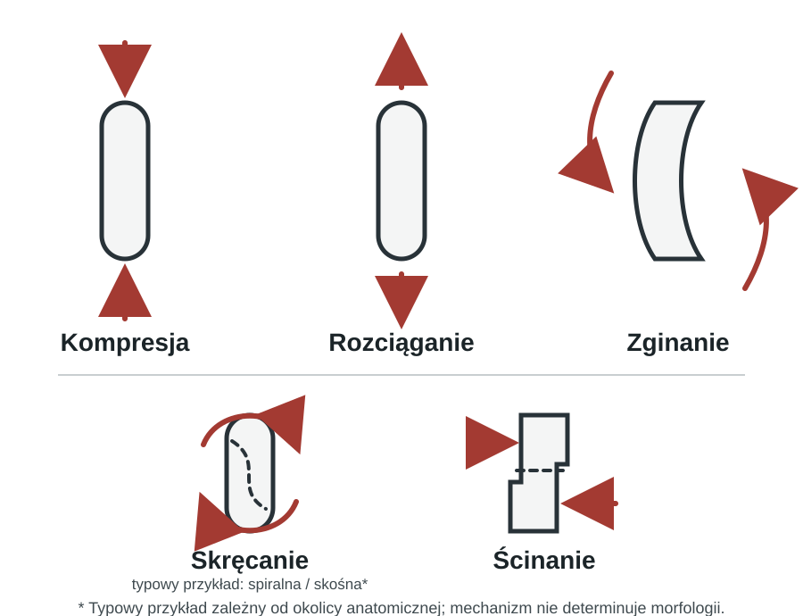
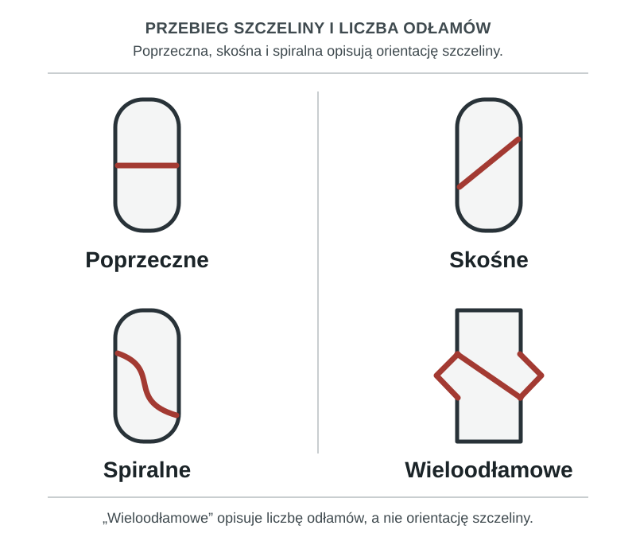

<!-- source: slide 33 -->
<!-- evidence: FMC-001 -->

Złamanie jest zaburzeniem ciągłości struktury kości [@nlmMeshFractures]. Można je
opisać jednocześnie na kilka sposobów: przez mechanizm urazu, wygląd szczeliny,
położenie odłamów, lokalizację i stan tkanek miękkich. Te opisy uzupełniają się,
ale nie tworzą jednego uniwersalnego systemu klasyfikacji.

## Czym jest złamanie

<!-- source: slides 33, 48 -->
<!-- evidence: FMC-002 -->

Określenia takie jak *zamknięte* i *otwarte* odnoszą się do stanu skóry i tkanek
miękkich. *Zmęczeniowe*, *patologiczne* i *osteoporotyczne* opisują natomiast
kontekst powstania lub właściwości kości. *Okołoprotezowe* i typu „zielonej
gałązki” wskazują na szczególną sytuację kliniczną albo wzorzec urazu. Nie należy
traktować tej listy jako jednego formalnego kodu klasyfikacyjnego; system AO/OTA
porządkuje przede wszystkim cechy anatomiczne i morfologiczne złamania
[@meinberg2018].

::: {.callout-important}
## Kluczowa zasada

Jedno złamanie może być równocześnie opisane przez lokalizację, morfologię,
przemieszczenie i stan tkanek miękkich.
:::

## Jak dochodzi do złamania

<!-- source: slide 36 -->
<!-- evidence: FMC-003 -->
<!-- evidence: FMC-004 -->

Złamanie może być następstwem urazu bezpośredniego lub pośredniego. Może też
powstać po urazie niskoenergetycznym albo po niewielkim obciążeniu — lub bez
rozpoznawalnego urazu — gdy kość jest osłabiona albo zmieniona chorobowo.

Osobną sytuacją jest złamanie zmęczeniowe, do którego mogą prowadzić sumujące
się mikrourazy [@nlmMeshFractures].

## Mechanizm urazu a charakter złamania

<!-- source: slide 38 -->
<!-- evidence: FMC-005 -->

Do złamania dochodzi, gdy na kość działa nadmierne obciążenie. Można je opisać
jako kompresję, dystrakcję, ścinanie lub rotację; w rzeczywistym urazie siły te
mogą działać łącznie.

Mechanizm pomaga rozumieć możliwy wzorzec urazu, ale nie wyznacza go w sposób
bezwzględny. Przykładowo, AO opisuje w obrębie dalszej części kości udowej
złamania spiralne i skośne jako mogące wynikać z sił skrętnych; jest to przykład
zależny od okolicy anatomicznej, a nie reguła dla każdego złamania
[@aoDistalFemurSimple].

<!-- figure: autorskie opracowanie dydaktyczne projektu, utworzone od podstaw; nie skopiowano grafiki z prezentacji. -->
{#fig-fracture-forces fig-cap="Typy obciążenia kości. Mechanizm urazu może sugerować wzorzec złamania, ale nie określa go samodzielnie; przedstawione zależności mają charakter typowy, a nie deterministyczny." fig-alt="Pięć schematów kości długiej pokazuje kolejno kompresję, rozciąganie, zginanie, skręcanie i ścinanie za pomocą strzałek. Tylko przy skręcaniu zaznaczono typowy, niedeterministyczny związek ze szczeliną spiralną lub skośną." width="100%" fig-align="center"}

<!-- candidate source slides: 34, 35, 38–39; preferred solution: new original educational figure -->

<!-- scope transfer: slides 40–41 → future unit `healing-and-rehabilitation-principles`; zrost i jego schemat są celowo wyłączone z tej strony. -->
<!-- scope transfer: slides 37, 43–47 i 52 → future unit `fracture-imaging-and-diagnosis`; przypadek i diagnostyka obrazowa są celowo wyłączone z tej strony. -->

## Podstawowe sposoby klasyfikacji złamań

<!-- source: slides 33, 48–49 -->
<!-- evidence: FMC-006 -->

Poniższa tabela porządkuje podstawowe cechy używane w opisie. Nie zastępuje
formalnej klasyfikacji AO/OTA [@meinberg2018].

| Kryterium | Kategorie wymienione w prezentacji |
|---|---|
| Stan skóry i tkanek miękkich | zamknięte, otwarte |
| Charakter powstania | ostre, przewlekłe (zmęczeniowe) |
| Przebieg szczeliny | poprzeczne, skośne, spiralne, wieloodłamowe |
| Położenie odłamów | nieprzemieszczone, przemieszczone |
| Lokalizacja | trzonu, przynasady, nasady, stawowe |

Określenie „ostre/przewlekłe” jest tu praktycznym opisem charakteru powstania,
a nie osią kodu AO/OTA.

## Morfologia i przebieg szczeliny złamania

<!-- source: slide 48 -->
<!-- evidence: FMC-007 -->

Przebieg szczeliny można opisać jako poprzeczny, skośny lub spiralny. Określenie
„wieloodłamowe” informuje przede wszystkim o liczbie odłamów, dlatego nie jest
tym samym wymiarem opisu co orientacja szczeliny [@aoDistalFemurSimple;
@meinberg2018].

<!-- figure: autorskie opracowanie dydaktyczne projektu, utworzone od podstaw; nie skopiowano grafiki z prezentacji. -->
{#fig-fracture-morphology fig-cap="Podstawowy opis przebiegu szczeliny złamania. Określenie „wieloodłamowe” odnosi się przede wszystkim do liczby odłamów, a nie do orientacji szczeliny." fig-alt="Cztery schematy tej samej kości długiej pokazują szczelinę poprzeczną, skośną i spiralną oraz złamanie wieloodłamowe z dodatkowym odłamem. Nota rozróżnia orientację szczeliny od liczby odłamów." width="100%" fig-align="center"}

<!-- candidate source slides: 34–35; preferred solution: new original educational figure -->

## Przemieszczenie odłamów

<!-- source: slide 48 -->
<!-- evidence: FMC-008 -->

Opis przemieszczenia powinien być oddzielony od opisu morfologii szczeliny.
Może obejmować zmianę długości (skrócenie albo distrakcję/rozejście odłamów),
angulację oraz rotację. Wklinowanie jest szczególnym opisem ustawienia odłamów;
nie należy utożsamiać go z każdym skróceniem [@meinberg2018].

## Złamania zamknięte i otwarte

<!-- source: slides 33, 48, 50 -->
<!-- evidence: FMC-009 -->
<!-- evidence: FMC-010 -->

W złamaniu zamkniętym nie ma komunikacji rany ze złamaniem. W złamaniu otwartym
dochodzi do naruszenia skóry i tkanek miękkich oraz komunikacji rany ze
złamaniem; widoczne wystawanie kości nie jest konieczne do takiego rozpoznania
[@aoOpenFractures].

Klasyfikacja Gustilo–Andersona służy do opisu ciężkości złamań otwartych. Jej
podstawowe stopnie to I, II i III, a stopień III został podzielony na IIIA, IIIB
i IIIC. Uwzględnia ona przede wszystkim ciężkość rany i uszkodzenia tkanek
miękkich. Typ IIIC dotyczy urazu tętniczego wymagającego naprawy dla zachowania
żywotności kończyny [@gustilo1976; @gustilo1984; @aoOpenFractures].

Na tej stronie klasyfikacja pełni funkcję porządkującą: pomaga opisać uraz, ale
nie jest algorytmem leczenia. Szczegółowe postępowanie z otwartym złamaniem
należy do odrębnego modułu.

::: {.callout-note}
## Zakres tej strony

Na tej stronie nie omawiamy szczegółowego postępowania terapeutycznego.
:::

<!-- scope transfer: slide 51 → future unit `fracture-treatment-principles`; informacje o leczeniu złamań otwartych są celowo wyłączone z tej strony. -->
<!-- scope transfer: slides 42 i 53 → future unit `fracture-recognition-and-differential-diagnosis`; objawy i różnicowanie są celowo wyłączone z tej strony. -->
<!-- scope transfer: slide 54 → future unit `fracture-prevention`; materiał jest zbyt krótki, aby obecnie tworzyć osobną stronę. -->

## Do zapamiętania

<!-- source: slides 33, 38, 48, 50 -->

- Jedno złamanie można opisać według kilku współistniejących cech.
- Mechanizm urazu może sugerować wzorzec złamania, ale go nie determinuje.
- Morfologia szczeliny, liczba odłamów i przemieszczenie to odrębne elementy
  opisu.
- Klasyfikacja Gustilo–Andersona porządkuje ciężkość złamań otwartych; nie jest
  samodzielnym algorytmem leczenia.

## Pytania kontrolne

<!-- source: slides 33, 36, 38, 48, 50 -->

1. Jakie cechy mogą równocześnie opisywać jedno złamanie?
2. Dlaczego mechanizm urazu nie determinuje jednoznacznie morfologii złamania?
3. Czym różni się opis morfologii szczeliny od opisu przemieszczenia odłamów?
4. Kiedy złamanie określa się jako otwarte?
5. Jaki jest zakres klasyfikacji Gustilo–Andersona na tej stronie?
